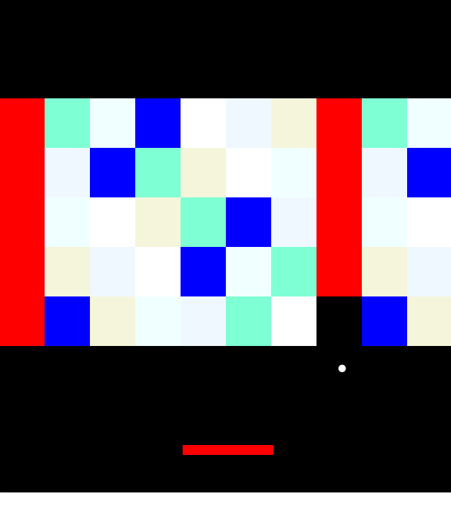

# 🧱 Breakout Game – JavaFX Edition

A polished version of the classic **Breakout** game written in **Java** using **JavaFX**. The game features paddle control, bouncing ball physics, and dynamic brick layout.

---

## 🎮 Features

- JavaFX-based 2D gameplay
- Smooth paddle movement with mouse
- Ball collision with bricks and paddle
- Level generation system with colored bricks
- Money bricks with visual highlights
- Win condition and auto exit

---

## 🛠 Technologies Used

- Java 17+
- JavaFX
- Object-Oriented Design

---

## 🚀 Getting Started

### Prerequisites

- Java JDK 17
- JavaFX SDK

### 📦 How to Run

1. Clone the repository:

```bash
git clone https://github.com/vbnk22/BrakeoutGame
cd breakout-java
```

2. Compile the game:

```bash
javac BreakoutGame.java
```

3. Run the game:

```bash
java BreakoutGame
```

### 🖼️ Screenshots


